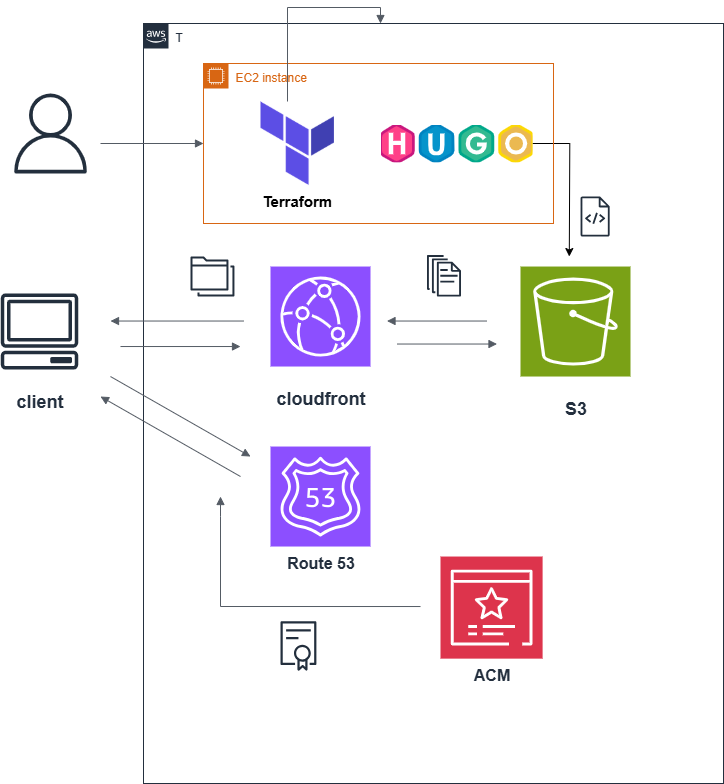

本記事ではサイトの構成について記載しています。

### 使用サービス・構成

・Terraformを使って構築・管理を行っており、コンテンツ作成のSSGにHugoを使用しています。

・Github ActionsでCI/CDを構築しており、以下の２つのワークフローとなっています。
　
  ①featureブランチへのpushをトリガーにplanの自動実行し問題がなければPRを作成する。

  ②PRにコメントされたplan結果を確認し、mainブランチへマージすることでapplyを実行する。

・AWSサービスの基本構成としては、S3に配置したコンテンツをCloudfrontで配信しています。
　独自ドメインゾーンをRoute53で管理し、ACMにて証明書を管理しTLS化させています。
  

